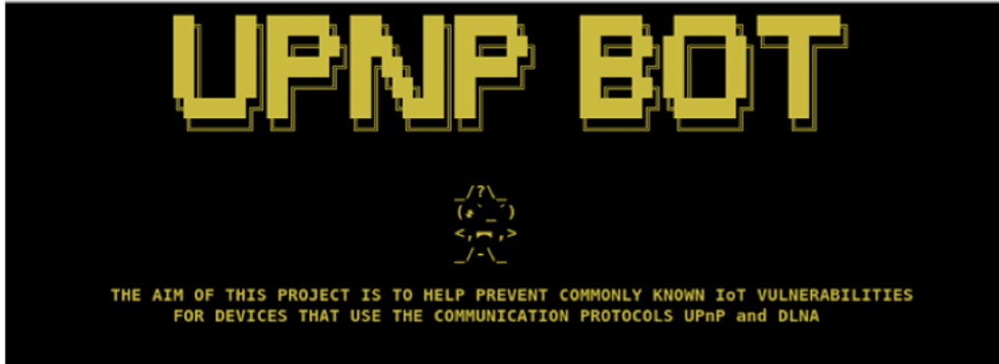

# Design

As a proof of concept of how a malicious user could exploit a poorly configured router, that uses default credentials using the networking protocol UPnP often used in IoT devices such as routers and other essential devices. Research was carried out using the search engine Shodan which revealed that over 12,000 routes open on the internet used default credentials, to illustrate the vulnerability. A bot called UPnP_Bot was developed with several automated functions, firstly the ability to scan to discover all UPnP services within multicast range, capture and monitor on going traffic from local IoT devices. Using the Mirai bot as an example several ports were scanned firstly 2323/TCP, 23/TCP in order to monitor for attempts to gain unauthorised control and port 48101 looking for infected devices often attempt to spread malware by using the port. In addition, the application also enables the automated playing of media content the likes of jpg, png, mp3, mp4 and mov. In order to create the testing framework various kinds of functionalities requirements were outlined. 

| Functionaility | Description  | 
| ------------- | ------------- |
| Scan           | Scan to discover all UPnP/DLNA services within multicast range | 
| Play           | Send media content via HTTP server to local IoT device             (Television set) | 
| DoS            | Send large numbers of pings to the specified local IoT IP address | 
| Live Traffic TCP capture | Capture packets and monitor all ongoing traffic from local network using tshark | 
| Monitor ports  | Scan ports 2323/TCP, 23/TCP and 4810/TCP | 

The method used to play media content on a targeted IoT device for instance a Smart TV required several steps to be taken, firstly carrying out a SSDP M-Search broadcast to discover available services on a network, followed by setting up a local HTTP server that would be used to send a SETAVTransportURL containing a http url of a media that is sent to the victim’s IoT device. To play the media file that has been sent, for that point the attacker is able to display media on the victims IoT device. In addition, the attacker is also able to send a Denial of Service (DoS) attack, 
in the past similar attacks have been carried out, for instance for a Smart TV such as a Samsung TV the exploit CVE-2013-4890 could be used to send a long URI to port 5600. Alternatively, large http traffic could also be sent to the victim’s IoT device in an attempt to DoS the victim’s IoT device.  

# Usage 

bash UPnP_Bot.sh

# Requirements 

python setup.py

# To-Do List 

Re-Add CVE API vulnerability checker to tool

# Disclaimer:
 
Redistribution and use in source and binary forms, with or without modification, are permitted provided that the following conditions are met:

* Redistributions of source code must retain the above copyright notice, 
  this list of conditions and the following disclaimer.

* Redistributions in binary form must reproduce the above copyright notice,
  this list of conditions and the following disclaimer in the documentation
  and/or other materials provided with the distribution.

* Neither the name of UPnP_Bot nor the names of its contributors 
  may be used to endorse or promote products derived from this software 
  without specific prior written permission.

THIS SOFTWARE IS PROVIDED BY THE COPYRIGHT HOLDERS AND CONTRIBUTORS "AS IS" AND ANY EXPRESS OR IMPLIED WARRANTIES, INCLUDING, BUT NOT LIMITED TO, THE IMPLIED WARRANTIES OF MERCHANTABILITY AND FITNESS FOR A PARTICULAR PURPOSE ARE DISCLAIMED. IN NO EVENT SHALL THE COPYRIGHT OWNER OR CONTRIBUTORS BE LIABLE FOR ANY DIRECT, INDIRECT, INCIDENTAL, SPECIAL, EXEMPLARY, OR CONSEQUENTIAL DAMAGES (INCLUDING, BUT NOT LIMITED TO, PROCUREMENT OF SUBSTITUTE GOODS OR SERVICES; LOSS OF USE, DATA, OR PROFITS; OR BUSINESS INTERRUPTION) HOWEVER CAUSED AND ON ANY THEORY OF LIABILITY, WHETHER IN CONTRACT, STRICT LIABILITY, OR TORT (INCLUDING NEGLIGENCE OR OTHERWISE) ARISING IN ANY WAY OUT OF THE USE OF THIS SOFTWARE, EVEN IF ADVISED OF THE POSSIBILITY OF SUCH DAMAGE.
